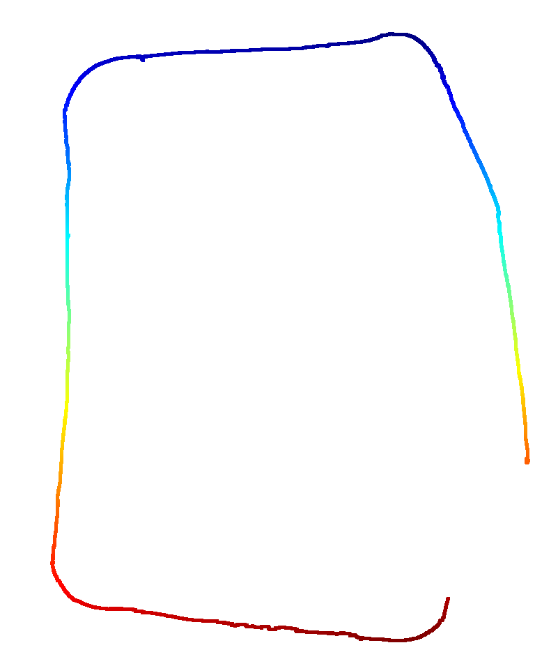

# VisualOdom
This is a research project aims to analyze both direct/indirect methods used for visual odometry algorithms.
This Repo will contain code for

Monocular Method
- OrbOdom, SiftOdom
- OpticalFlow based OrbOdom, SiftOdom
Stereo Method
- OrbOdom, SiftOdom
- OpticalFlow based OrbOdom, SiftOdom

KITTI is used to benchmark results and ARL-Sample is used to infere some results

<i><b>sample result of SiftOdom</b> Trajectory on <b>playground</b> test-scene</i>

   

**To Do**

- Features Tracking.
- Mapping.
- C++ Implementation.

