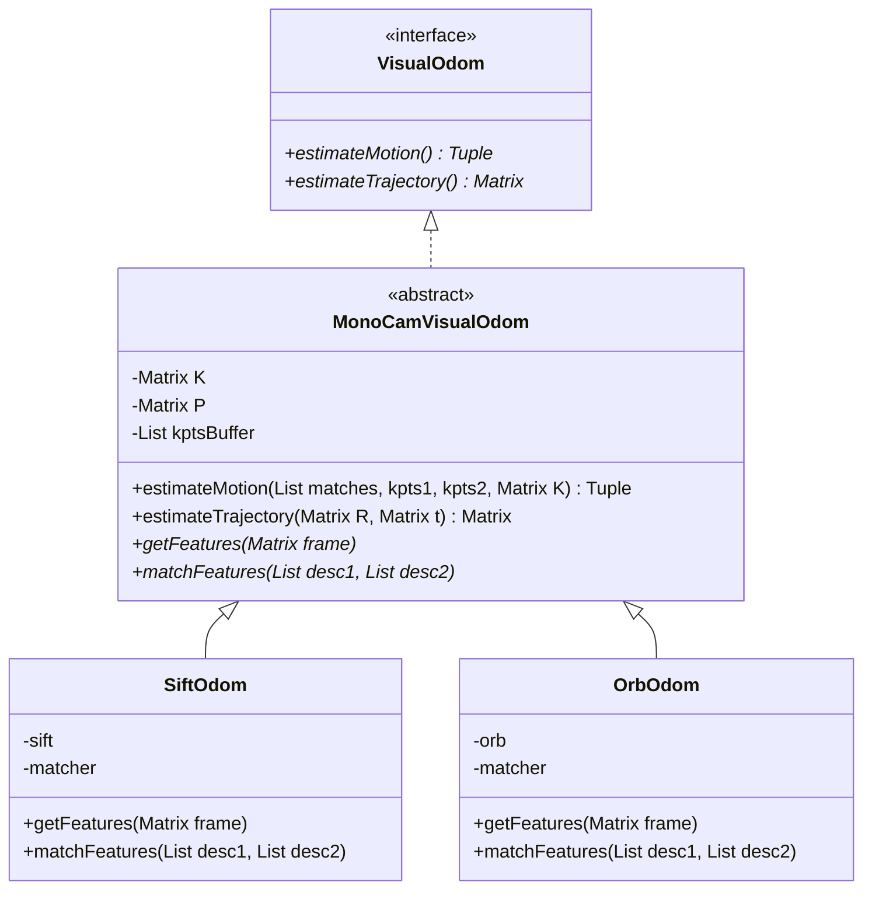

```mermaid
classDiagram

class VisualOdom{
	<<interface>>
	+estimateMotion()* Tuple
	+estimateTrajectory()* Matrix
}

class MonoCamVisualOdom{
	<<abstract>>
	-Matrix<float32> K
	-Matrix<float32> P
	-List<KeyPoint> kptsBuffer
	+estimateMotion(List matches, kpts1, kpts2, Matrix K) Tuple
	+estimateTrajectory(Matrix R, Matrix t) Matrix
	+getFeatures(Matrix frame)*
	+matchFeatures(List desc1, List desc2)*
}

class SiftOdom{
	-sift
	-matcher
	+getFeatures(Matrix frame)
	+matchFeatures(List desc1, List desc2)
}

class OrbOdom{
	-orb
	-matcher
	+getFeatures(Matrix frame)
	+matchFeatures(List desc1, List desc2)
}

VisualOdom <|.. MonoCamVisualOdom
MonoCamVisualOdom <|-- SiftOdom
MonoCamVisualOdom <|-- OrbOdom
```
